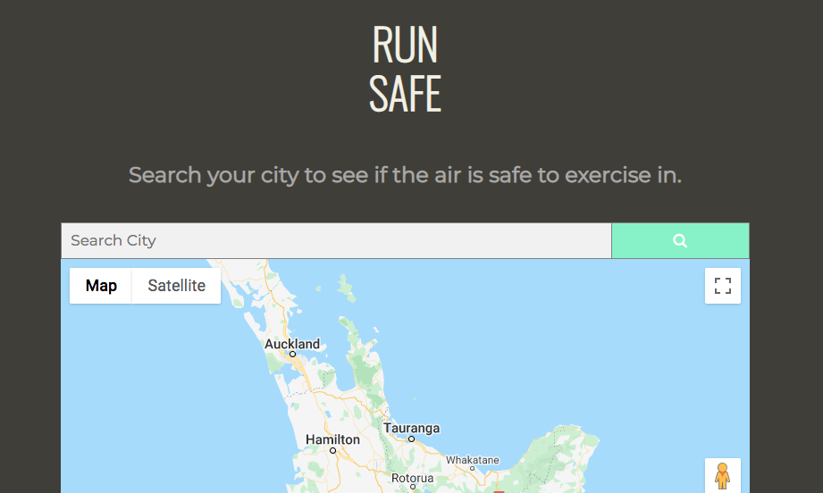
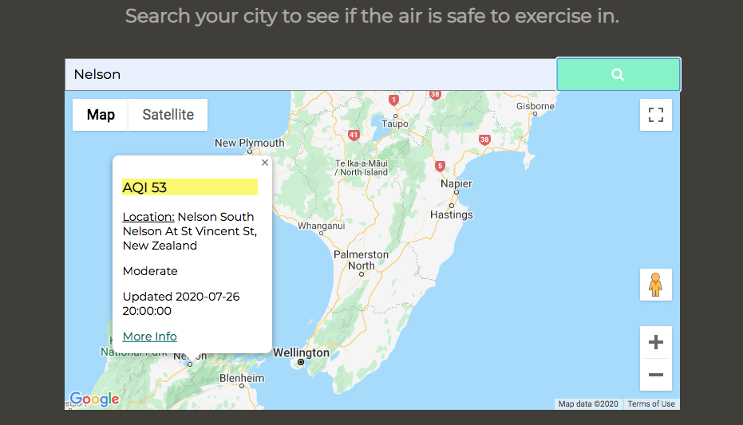
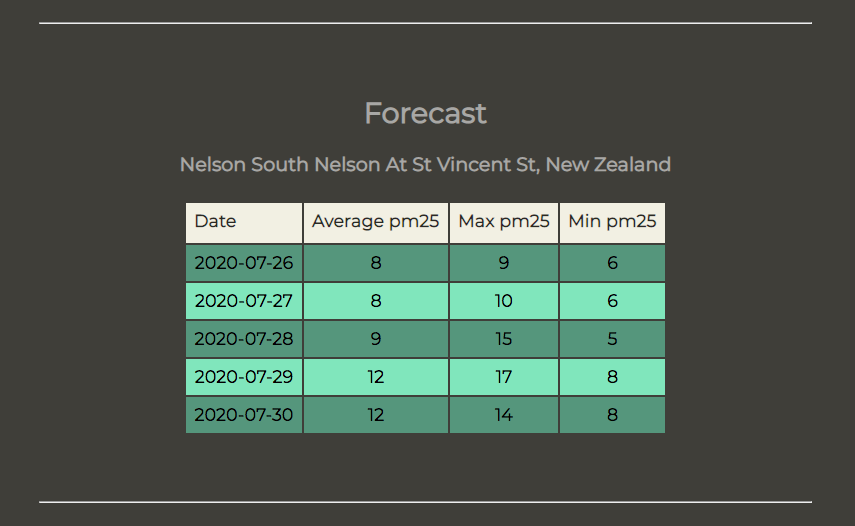
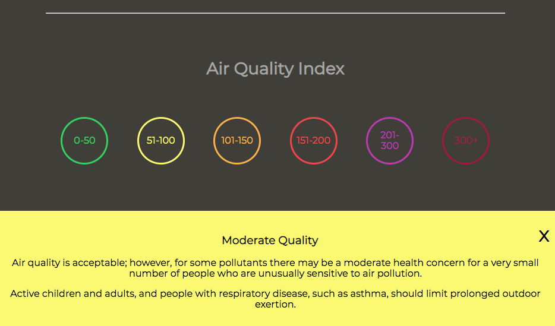

# run-safe

## Link to App
https://sirkismatt.github.io/run-safe/

## Screenshots
Landing page:

After submission:

Forecast:

AQI Chart:

## Summary
This app helps joggers determine if their cities air quality is safe to exercise in, The app informs the user of the air quality index of the city that they search for, a forecast for when it could be safe to run, and info about air quality health implications. 

## Technology used: 
HTML/CSS/JavaScript/jQuery
